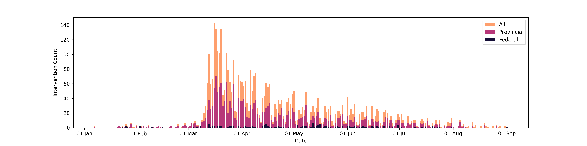

# CAN-NPI: A Curated Open Dataset of Canadian Non-Pharmaceutical Interventions in Response to the Global COVID-19 Pandemic


[](https://creativecommons.org/licenses/by/4.0/)

Non-pharmaceutical interventions (NPIs) have been the primary tool used by governments and organizations to mitigate the spread of the ongoing pandemic of COVID-19. Natural experiments are currently being conducted on the impact of these interventions, but most of these occur at the subnational level - data not available in early global datasets. We describe the rapid development of the first comprehensive, labelled dataset of NPIs implemented at federal, provincial/territorial and municipal  levels in Canada to guide COVID-19 research. For each intervention, we provide: a) information on timing to aid in longitudinal evaluation, b) location to allow for robust spatial analyses, and c) classification based on intervention type and target population, including classification aligned with a previously developed measure of government response stringency. 

A paper describing the dataset can be read [here](http://cmajopen.ca/content/8/3/E545.full).

This dataset covers the beginning period of the pandemic, starting in January 2020; further data updates to continue for the duration of the pandemic. This novel dataset enables robust, inter-jurisdictional comparisons of pandemic response, can serve as a model for other jurisdictions and can be linked with other information about case counts, transmission dynamics, health care utilization, mobility data and economic indicators to derive important insights regarding NPI impact. 

Here we show the count of recorded interventions by time in the dataset:



We also provide a list of announcements directly from provincial government sources in the [`sources/`](https://github.com/jajsmith/COVID19NonPharmaceuticalInterventions/tree/master/sources) folder. These announcements include articles that are not related to COVID-19. They are updated twice a day and include a model-estimated probability of being about COVID-19 intervention-related topics.

## Get the Data

You can use this direct link to get the data, which is stored in CSV format in this repository.

| Name  | Content | Rows | Size |  Link |
| --- | --- | --- | --- | --- |
| `npi_canada.csv` | All Canadian NPIs | 4,390 | 17 MB | [Download](https://raw.githubusercontent.com/jajsmith/COVID19NonPharmaceuticalInterventions/master/npi_canada.csv) |
| `sources/` | All Canadian Provincial Announcements during Period | 13 Files | 30 MB | [View Files](https://github.com/jajsmith/COVID19NonPharmaceuticalInterventions/tree/master/sources) |

Alternatively you can clone this GitHub repository, where the dataset is named `npi_canada.csv`. The repository also contains notebooks for visualizations and demonstrations with the data.

```
git clone git@github.com:jajsmith/COVID19NonPharmaceuticalInterventions.git
```


## Access and Details

The codebook and additional details can be found at https://docs.google.com/spreadsheets/d/1NSRyeY7XUjwUO8KICJCsOd2YKwuYaSAuM_yEnXMUbOY/edit?usp=sharing

**Time Period:** January 1, 2020 to September 1, 2020.


## Methods and Citations

If you find CAN-NPI helpful and use it in a scientific publication, we would appreciate you referencing the following paper:

Characterizing early Canadian federal, provincial, territorial and municipal nonpharmaceutical interventions in response to COVID-19: a descriptive analysis. Liam G McCoy, Jonathan Smith, Kavya Anchuri, Isha Berry, Joanna Pineda, Vinyas Harish, Andrew T Lam, Seung Eun Yi, Sophie Hu, Laura Rosella, Benjamin Fine, COVID-19 Canada Open Data Working Group: Non-PHarmaceutical Interventions. *CMAJ OPEN*. 2020; 8(3):E545-E553. Published 2020 Aug 31. [doi:10.9778/cmajo.20200100](http://cmajopen.ca/content/8/3/E545.full)

## Interested in Contributing?

If you have a correction or addition, please open a github issue.

Join the team or contact us at [howsmyflattening.ca](https://howsmyflattening.ca/#/home)

